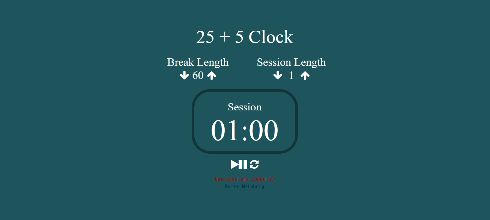

# 25 + 5 Clock

## Description
> A Svelte-based Pomodoro timer app with adjustable session and break lengths, start/pause/reset functionality, countdown display, and audio alerts on zero.

## Features
- Session/Break length adjustment (1-60 mins)
- Start, pause, and reset functionality
- Countdown display (mm:ss)
- Audio alert on countdown completion
- Responsive design

## Tech Stack

## Usage
1. Set session/break lengths.
2. Start countdown.
3. Pause/reset as needed.
4. Enjoy the alert on completion.

# Design

